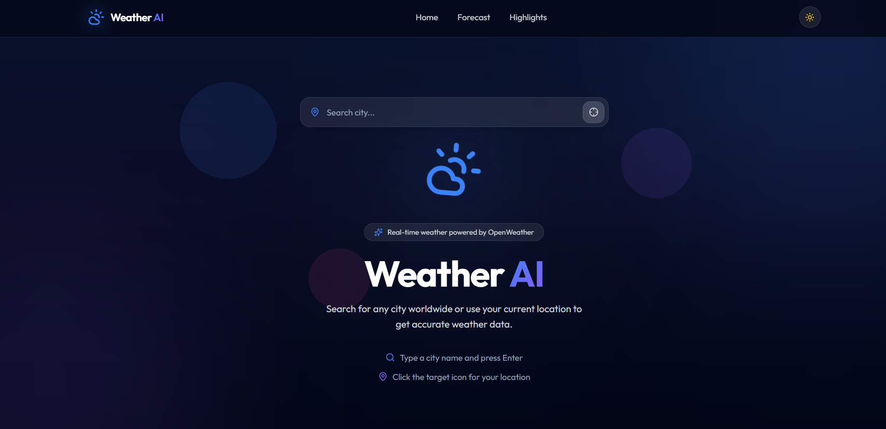
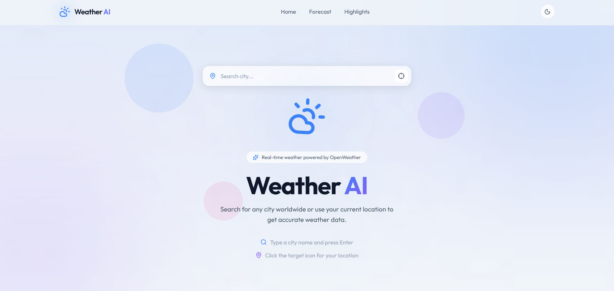

<div align="center">
  

  # Weather AI

  <p><strong>Premium Modern Weather Application</strong></p>

  <p>
    
    
    
    
    
  </p>

  <p>
    
    
    
    
  </p>

  <br />

  <!-- Add a screenshot at public/screenshot.png to showcase the UI -->

  <br />
</div>

## Overview

Weather AI is a premium, modern weather application built with React 19 and TypeScript. It provides real-time weather data with a beautiful glassmorphic UI, dynamic weather backgrounds, and full dark/light mode support. Powered by the OpenWeather API.

### Features

- **Real-Time Weather Data** -- Current conditions, hourly forecast, and 5-day outlook
- **City Search** -- Search any city worldwide with smart autocomplete suggestions
- **Geolocation** -- One-click weather for your current location
- **Search History** -- Recently searched cities persisted locally
- **Dynamic Weather Backgrounds** -- Animated rain, snow, stars, clouds, and sun rays based on conditions
- **Dark / Light Mode** -- System-aware with manual toggle and smooth transitions
- **Glassmorphic UI** -- Premium glass cards with blur effects and subtle animations
- **Fully Responsive** -- Optimized from 320px mobile to 1920px desktop
- **Accessible** -- ARIA labels, keyboard navigation, reduced motion support
- **Performance Optimized** -- Code splitting, memoization, lazy loading

### Tech Stack

| Technology   | Purpose                     |
| ------------ | --------------------------- |
| React 19     | UI library                  |
| TypeScript 6 | Type safety                 |
| Vite 8       | Build tool & dev server     |
| Tailwind CSS 4 | Utility-first styling    |
| Framer Motion 12 | Animations & transitions |
| TanStack Query 5 | Server state management |
| Axios        | HTTP client                 |
| Lucide React | Icon library                |
| OpenWeather API | Weather data source      |

## Getting Started

### Prerequisites

- Node.js 22+
- npm 10+
- OpenWeather API key (free tier)

### Installation

```bash
# Clone the repository
git clone https://github.com/yourusername/weather-ai.git
cd weather-ai

# Install dependencies
npm install

# Configure environment variables
cp .env.example .env
# Edit .env and add your OpenWeather API key:
# VITE_OPENWEATHER_API_KEY=your_api_key_here

# Start development server
npm run dev
```

### Build for Production

```bash
npm run build
npm run preview
```

### Lint

```bash
npm run lint
```

## Environment Variables

| Variable                    | Required | Description                |
| --------------------------- | -------- | -------------------------- |
| `VITE_OPENWEATHER_API_KEY`  | Yes      | Your OpenWeather API key   |

Get your free API key at [openweathermap.org/api](https://openweathermap.org/api).

## Project Structure

```
src/
├── components/
│   ├── layout/          # Navbar, Footer
│   ├── ui/              # SearchBar, ThemeToggle, ErrorMessages, EmptyState, Loading
│   └── weather/         # Hero, WeatherCard, ForecastCard, HighlightCard, WeatherBackground
├── hooks/               # Custom hooks (useWeather, useTheme, useSearchHistory)
├── pages/               # Page components (Home)
├── services/            # API services (weather)
├── styles/              # Global styles (index.css)
├── types/               # TypeScript types and interfaces
├── utils/               # Utility functions
├── constants/           # Application constants
├── App.tsx              # Root component
└── main.tsx             # Entry point
```

## Deployment

### Vercel

[](https://vercel.com/new)

1. Push to GitHub
2. Import project into Vercel
3. Add environment variable `VITE_OPENWEATHER_API_KEY`
4. Deploy

### Netlify

[](https://app.netlify.com/start)

1. Push to GitHub
2. Import project into Netlify
3. Set build command: `npm run build`
4. Set publish directory: `dist`
5. Add environment variable `VITE_OPENWEATHER_API_KEY`
6. Deploy

## API Usage

This project uses the [OpenWeather API](https://openweathermap.org/api):

- **Current Weather Data** -- `api.openweathermap.org/data/2.5/weather`
- **5-Day / 3-Hour Forecast** -- `api.openweathermap.org/data/2.5/forecast`

The free tier allows 60 requests per minute and 1,000,000 calls per month.

## Future Improvements

- PWA support with service worker for offline caching
- Weather maps (rain, temperature, wind layers)
- Severe weather alerts and notifications
- Historical weather data and charts
- Multiple location saved favorites
- Unit conversion (metric / imperial)
- Weather widgets (embeddable)
- Internationalization (i18n)
- End-to-end testing with Playwright

## Acknowledgments

- [OpenWeather](https://openweathermap.org/) for the weather data API
- [Lucide](https://lucide.dev/) for the beautiful open-source icons
- [Framer Motion](https://www.framer.com/motion/) for animation library
- [TanStack Query](https://tanstack.com/query) for data fetching
- [shadcn/ui](https://ui.shadcn.com/) for component design inspiration

## License

This project is licensed under the MIT License -- see the [LICENSE](LICENSE) file for details.

---

<div align="center">
  <p>Built with ❤️ by <strong>Dhrub</strong></p>
  <p>
    <a href="https://github.com/dhrub">GitHub</a>
    ·
    <a href="https://linkedin.com/in/dhrub">LinkedIn</a>
  </p>
</div>





